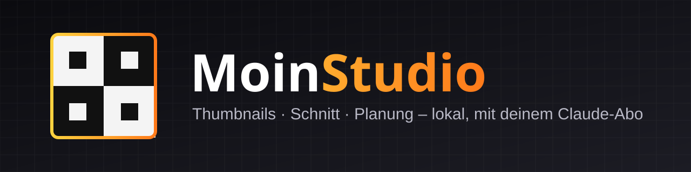
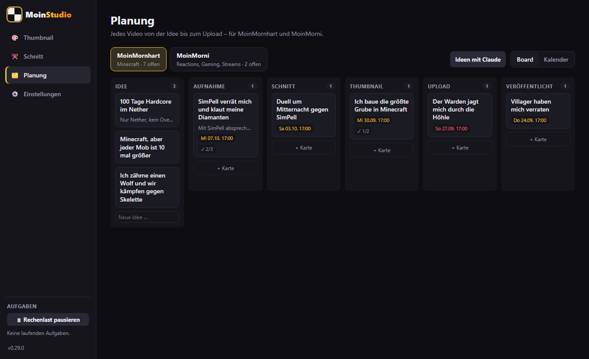
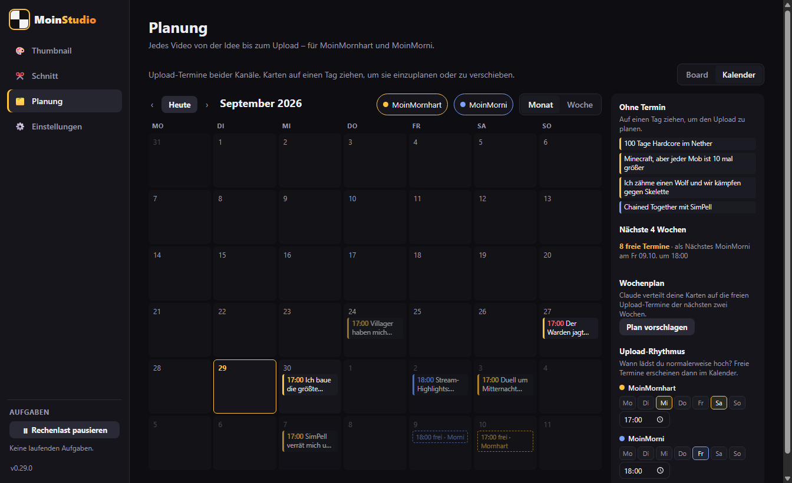
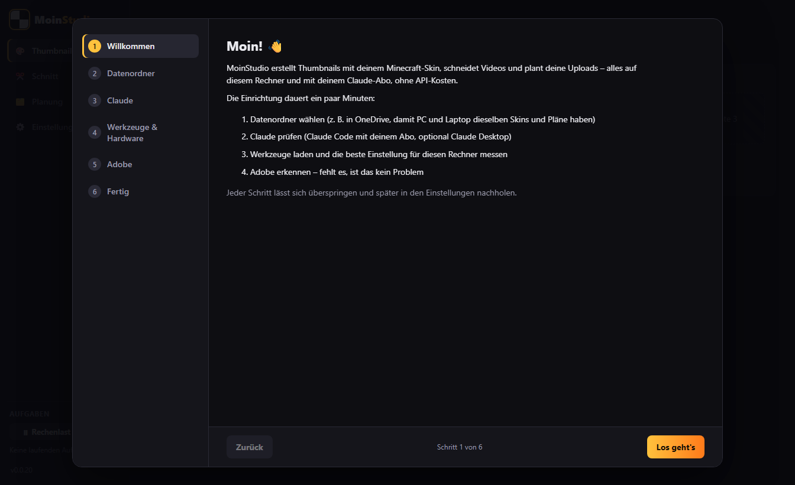
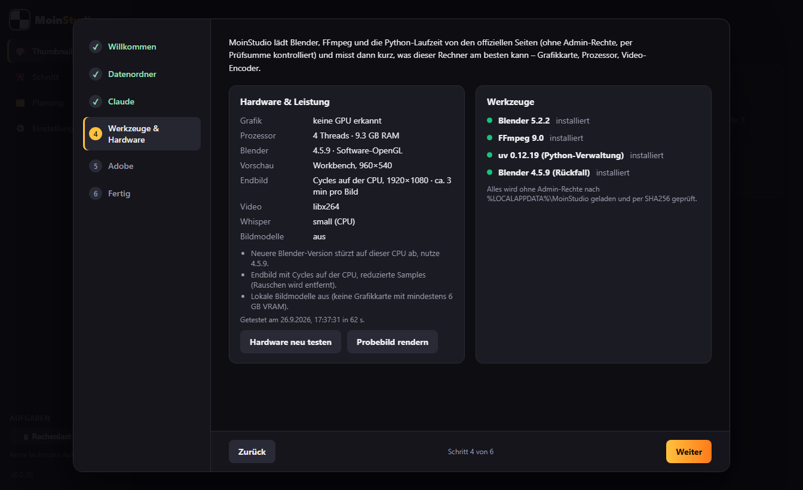

<p align="center">
  
</p>

<p align="center">
  <a href="https://github.com/MoinMornhart/moinstudio/releases"></a>
  <a href="https://github.com/MoinMornhart/moinstudio/commits"></a>
  <a href="LICENSE"></a>
  
  
</p>

**MoinStudio** ist eine lokale Windows-Desktop-App für die YouTube-Kanäle **MoinMornhart** und **MoinMorni**. Sie erstellt Thumbnails mit dem eigenen Minecraft-Skin aus beliebigen Beschreibungen in normaler Sprache, schneidet Videos und plant Uploads. Die KI-Logik läuft ausschließlich über das eigene **Claude-Abo** (Claude Desktop per MCP und Claude Code per Abo-Login), ohne API-Key und ohne Cloud-Server.

> **Status (29.09.2026):** Alle drei Reiter sind gebaut und mit Testdaten geprüft: Thumbnail, Schnitt und Planung. Es fehlen noch Philips Abnahmen mit echten Aufträgen und Videos. Danach folgt Version 1.0.0. Fortschritt: [ROADMAP](ROADMAP.md).

<p align="center">
  
  
</p>

<p align="center">
  
  
</p>

## Was funktioniert

- **Installer ohne Admin-Rechte** mit Startmenü, Desktop-Verknüpfung und optionalem Autostart
- **Selbst-Update** aus den GitHub-Releases per Knopfdruck
- **Einrichtungsassistent** beim ersten Start: Datenordner, Claude, Werkzeuge, Hardware, Adobe
- **Hardware-Test pro Gerät:** misst Blender (Workbench/EEVEE/Cycles auf CPU und jeder GPU-Art), Video-Encoder und wählt automatisch die beste Einstellung, mit Rückfällen für Rechner ohne GPU oder mit älterer CPU
- **Werkzeuge** (Blender, FFmpeg, Python/uv) lädt die App selbst, geprüft per SHA256 und unsichtbar im Hintergrund
- **Aufgaben** mit Fortschritt, Pause (hält Blender/FFmpeg wirklich an), Abbruch und Fortsetzen nach Neustart; Knopf „Rechenlast pausieren“
- **Claude über dein Abo:** Claude Code headless mit Limit-Erkennung und automatischem Weitermachen nach dem Reset; MCP-Server für Claude Desktop
- **Datenordner** frei wählbar (z. B. OneDrive), OneDrive-sicheres Speichern, Konflikterkennung

## Die drei Reiter

| Reiter | Was er kann | Status |
|--------|-------------|--------|
| 🎨 **Thumbnail** | Beschreibung oder Video → Szene in Blender im Stil großer Minecraft-Kanäle → Varianten, jede mit ihrem Vorbild; Reaction- und Gaming-Thumbnails, eigenes Bild, Spiele-Vorlagen, Freunde im Bild, Änderungswünsche in Worten | gebaut, Abnahme offen |
| ✂️ **Schnitt** | Rohvideo rein, fertiges Video raus: Transkript (lokal), Rohschnitt ohne Pausen und Versprecher, Änderungen in Worten, Untertitel, Zooms, YouTube-Export mit Titel, Beschreibung und Kapiteln, Stream-Highlights und Shorts | gebaut, Abnahme offen |
| 🗂️ **Planung** | Board je Kanal, Kalender mit Upload-Rhythmus und freien Terminen, Karte startet Schnitt und Thumbnail und rückt selbst weiter, Ideen, Titel und Wochenplan mit Claude | gebaut, Abnahme offen |

Alles lässt sich auch aus **Claude Desktop** steuern: Thumbnails, `video_edit` für den Schnitt und `planning` für die Planung. Die Planung funktioniert dort sogar, wenn MoinStudio geschlossen ist.

## Neueste Änderungen

<!-- CHANGELOG:START -->
- **0.33.0** (2026-09-30): Premiere: Effekte
- **0.32.0** (2026-09-30): Schnitt: Wünsche und Effektliste
- **0.31.0** (2026-09-30): Schnitt: Intro-Baukasten
- **0.30.0** (2026-09-30): Schnitt: Effekt-Bausteine
- **0.29.8** (2026-09-30): Plan: Effekte per Sprache
<!-- CHANGELOG:END -->

## Installation

1. Den neuesten `MoinStudio-Setup-x.y.z.exe` unter [Releases](https://github.com/MoinMornhart/moinstudio/releases) herunterladen. Fertige Funktionen erscheinen dort automatisch als Release mit Installer, die App aktualisiert sich danach selbst (Einstellungen → „Nach Updates suchen“).
2. Starten. Es sind keine Admin-Rechte nötig, MoinStudio wird nur für deinen Windows-Benutzer installiert.
3. Da die App nicht signiert ist, warnt Windows SmartScreen beim ersten Start: **„Weitere Informationen“ → „Trotzdem ausführen“**. Ist *Smart App Control* auf „Ein“ gestellt, blockiert Windows unsignierte Apps vollständig. Das lässt sich unter *Windows-Sicherheit → App- & Browsersteuerung* prüfen.

## Claude einrichten (dein Abo, kein API-Key)

1. **Claude Code** installieren ([claude.com/claude-code](https://claude.com/claude-code)) und einmal im Terminal `claude auth login` mit deinem Claude-Konto (Pro oder Max) ausführen. Der Einrichtungsassistent hat dafür einen Knopf.
2. **Claude Desktop** (optional): Einstellungen → Claude → „Mit Claude Desktop verbinden“, danach Claude Desktop komplett neu starten. Im Chat stehen dann die MoinStudio-Werkzeuge zur Verfügung (Status, Aufgaben, Renders ansehen …).
3. In claude.ai → Einstellungen → Nutzung die **Usage Credits ausgeschaltet** lassen. Dann entstehen nie Kosten über das Abo hinaus.

MoinStudio entfernt API-Key-Variablen aus der Umgebung von Claude Code und nutzt ausschließlich den Abo-Login. Details: [docs/claude-integration.md](docs/claude-integration.md).

## Adobe-Anbindung

Wer in Adobe weiterarbeiten will, bekommt die Ergebnisse fertig zum Nachbessern:

- **Schnitt → „Für Premiere“:** die Sequenz als FCP7-XML (alle Schnitte aus dem Original, Zooms als Keyframes, Kapitel als Marker) plus Untertitel als SRT.
- **Thumbnail → „Für Photoshop“:** eine PSD mit den Ebenen Hintergrund, Figuren (freigestellt) und Text.

Beides ist **ungetestet**, bis der Adobe-Selbsttest (Einstellungen → Adobe → „Selbsttest“, Anleitung in [tests/adobe/](tests/adobe/README.md)) auf einem Rechner mit Adobe bestanden ist. Ohne Adobe ist MoinStudio vollständig nutzbar. Grundlage: [docs/research/adobe.md](docs/research/adobe.md).

## Ordnerstruktur

```
src/main/      Electron-Hauptprozess
src/preload/   Sichere Brücke zwischen App und Oberfläche
src/renderer/  Oberfläche (React)
src/shared/    Gemeinsame Typen
blender/       Blender-Messskript für den Hardware-Test (Szenenbau folgt neu)
config/        Editierbare Konfiguration (z. B. channels.yaml)
docs/          Architektur, Recherche, Tests, Umgebung
tests/         Automatische Tests
scripts/       Hilfsskripte für Entwicklung und Release
.githooks/     Git-Hooks (Secret-Scan vor jedem Push)
```

Private Daten wie Skins, Freundes-Skins, Rohvideos und Referenz-Thumbnails liegen **nie** im Repo. Sie gehören in einen frei wählbaren Datenordner, zum Beispiel in OneDrive.

## Entwicklung

```powershell
git clone https://github.com/MoinMornhart/moinstudio.git
cd moinstudio
git config core.hooksPath .githooks   # gitleaks-Scan vor jedem Push
npm install
npm run check        # Typprüfung, Lint, Tests, Build
npm start            # App starten
npm run screenshot   # Screenshots aller Reiter nach test-output/screenshots
```

## Lizenz

[MIT](LICENSE)
